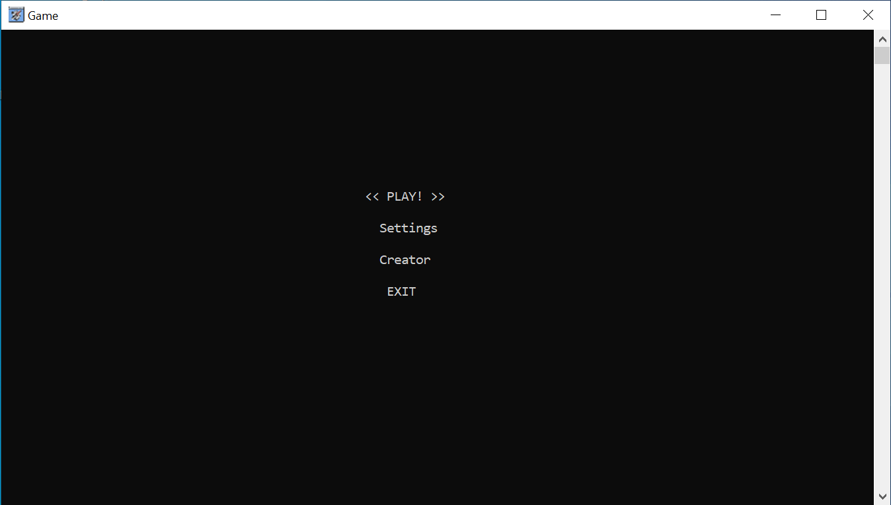
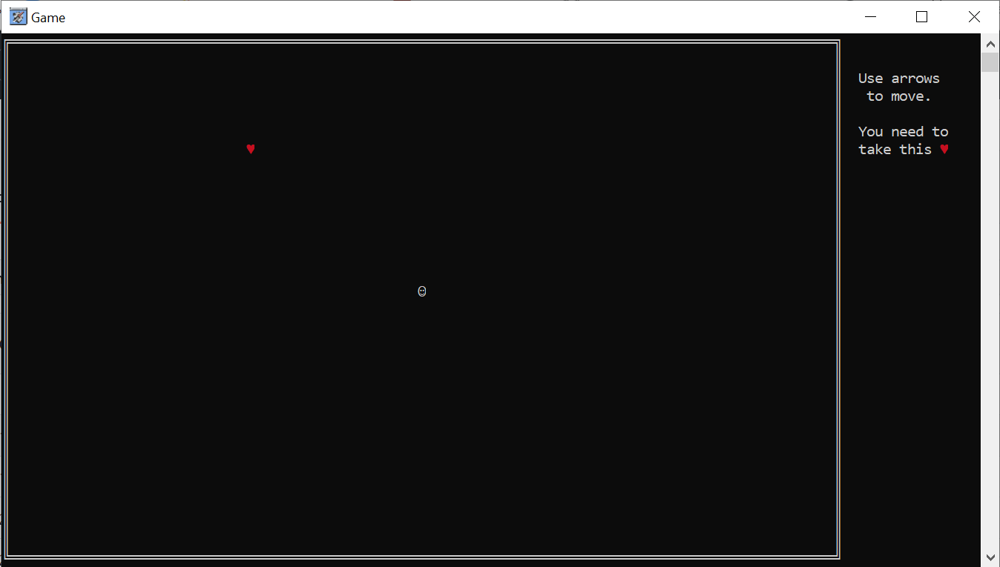

# Console-Game

Introduction:

Project, which you can see here, it’s a short game in console. I made this game on subject “fundamental of programming”. This game was written on language C++ in “Microsoft Visual Studio 2019”.

Main idea of the project is to make a game, which based on method “_getch” and moving the cursor to a point given by coordinates. I needed to create a character that could be controlled by using keyboard keys and add more some interactive to it.

Moreover, I add “threads” to make to make moving enemies and parallel display of instructions on the screen, also by using “threads” “Health Point”, “Mana Point” and “Score” available on the screen in same time.

Also, in this game there is a concept of “Fog of War”, which work on file methods. Using files, you can change the location of items and their number (File “FogofWar.txt”). 

What about functionality, on the first screen of this game, you can see main menu. There you can find “Settings”, where you can choose difficulty level. Also, there in the next point – “Creator”, you can find some information about me. I think that the rest of the points are clear.

In the end I wanted to say that, I completed this project on my own as first-year student in 2021.

12/20/2021

Project description:

Walkthrough:

1. Menu of game.

2. Settings, there you can change the level of difficulty
 

3. In the "Creator" you can see some information about creator of this game and find his contacts

4. Preview of 1 LV

5. 1 LV

6. Preview of 2 LV

7. 2 LV

8. Fog of War on 3 LV

9. Items that player can find on 3 LV.

10. Death screen

